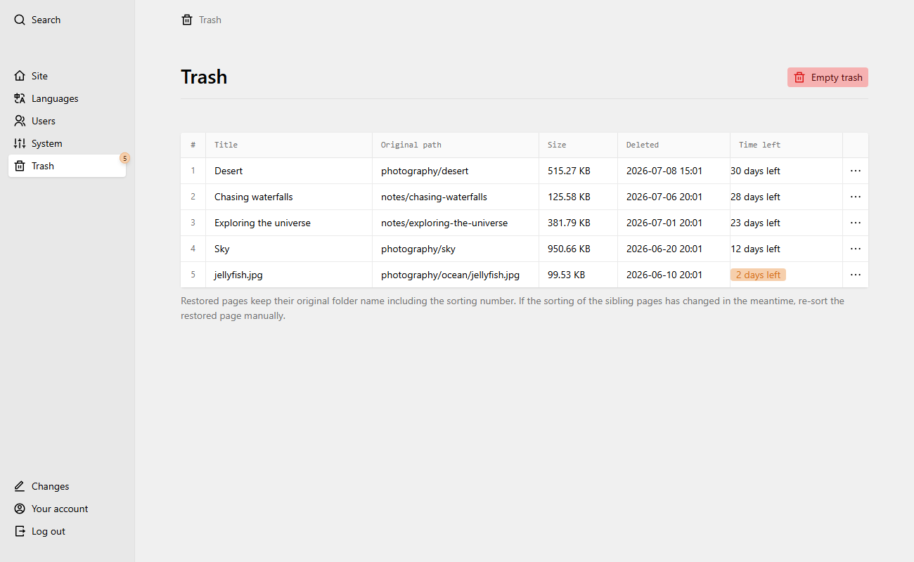
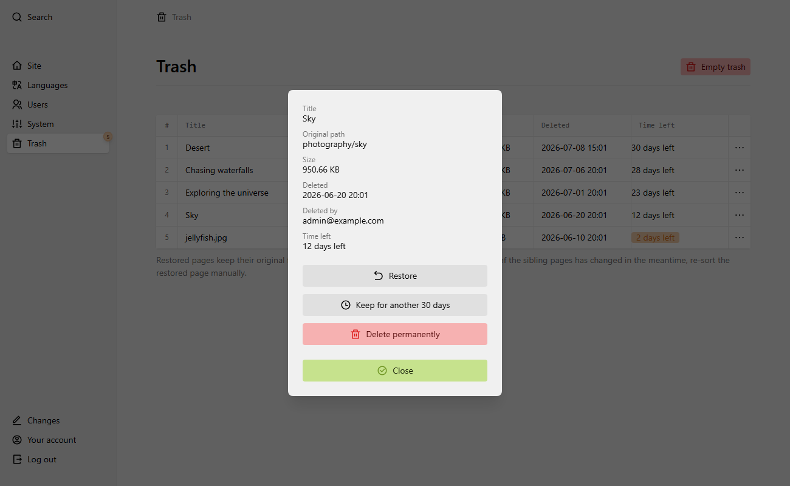

# Kirby Trash

A proper trash can for [Kirby CMS](https://getkirby.com): deleted pages and
files are not removed instantly but moved to a trash where they can be
restored or deleted permanently — via a dedicated Panel area.



## How it works

Kirby fires `page.delete:before` / `file.delete:before` hooks while the
content still exists on disk. This plugin copies the affected page folder
(including all languages, files, subpages and Kirby 5 `_changes` versions)
or the file (including all of its content files) into the trash storage and
then lets Kirby delete as usual.

If copying to the trash fails (disk full, missing write permissions, …),
the exception blocks the actual deletion — your content is never deleted
without a safety copy.

Restoring copies the item back to its original location. Parents are looked
up freshly (by UUID first, then by id), so renamed parent pages are handled
correctly. Content files are restored verbatim, which means **UUIDs survive**
and internal links keep working.

## Requirements

- Kirby 5.x
- PHP 8.2+

## Installation

### Composer

```
composer require sigtrygg-space/kirby-trash
```

> **Note:** this works once the plugin is published on Packagist. Until
> then, add the repository to your site's `composer.json` and require the
> development version:
>
> ```json
> {
>     "repositories": [
>         { "type": "vcs", "url": "https://github.com/sigtrygg-space/kirby-trash" }
>     ]
> }
> ```
>
> ```
> composer require sigtrygg-space/kirby-trash:dev-main
> ```

### Manual download

Download and extract this repository to `site/plugins/kirby-trash`.

### Git submodule

```
git submodule add https://github.com/sigtrygg-space/kirby-trash.git site/plugins/kirby-trash
```

## Panel

The plugin adds a **Trash** area to the Panel menu (trash icon). It lists
all trashed items in a table with their original path, size, deletion date
and the remaining days until automatic cleanup. Each item can be restored
or deleted permanently; the header button empties the whole trash (with a
confirmation dialog showing the number of items and total size).

On small screens the table is reduced to the most important columns; the
options menu of every row therefore also offers a details dialog with all
metadata (original path, size, deletion date, deleting user, time left)
and the restore / delete actions.



## Options

```php
// site/config/config.php
return [
    // days until items are removed automatically.
    // -1 = keep forever. 0 is treated as invalid and
    // falls back to the default (30), so a misconfiguration
    // can never wipe the trash instantly.
    'sigtrygg-space.kirby-trash.retentionDays' => 30,

    // where trashed items are stored (string or closure).
    // default: site/storage/trash
    'sigtrygg-space.kirby-trash.root' => null,

    // disable the trash entirely: deletions become permanent
    // again and the Panel area disappears. Also accepts a
    // closure for logic-driven switching, e.g. by environment:
    // 'enabled' => fn ($kirby) => $kirby->system()->isLocal() === false
    'sigtrygg-space.kirby-trash.enabled' => true,
];
```

### Storage location

By default the trash lives in `site/storage/trash/`, deliberately **outside**
of the content folder and outside of a typical Git deployment flow. If you
version your site with Git, add it to your `.gitignore`:

```
site/storage/
```

Each trash entry is a folder containing the original data plus a `meta.json`
with the original path, size, deletion date, the deleting user and UUIDs.
The metadata carries a `version` field, and items written by older plugin
versions are migrated on read — trash contents survive plugin upgrades.

### Automatic cleanup

Expired items are removed whenever the trash area or its API is opened.
Kirby has no native cron; if you want guaranteed cleanup on quiet sites,
run the bundled CLI command (requires [getkirby/cli](https://github.com/getkirby/cli))
as a cronjob:

```
kirby trash:cleanup
```

## Permissions

By default only admins can see and manage the trash. Admins always have
access — a custom `admin.yml` blueprint cannot lock them out accidentally.
Other roles can be allowed via their role blueprint:

```yaml
# site/blueprints/users/editor.yml
title: Editor
permissions:
  sigtrygg-space.kirby-trash:
    access: true
    restore: true
    delete: false
```

- `access` — see the trash area and its contents
- `restore` — restore items
- `delete` — delete items permanently / empty the trash

## Known limitations

- User files (e.g. avatars) are not moved to the trash; deleting them is
  permanent, as in plain Kirby.
- Restored pages keep their original folder name including the sorting
  number; if the sibling sorting changed in the meantime, you may want to
  re-sort manually.
- If a page or file with the same name has been created in the meantime,
  restoring fails with a clear error message instead of overwriting.
- The trash works on the filesystem level. In multi-server setups the
  trash storage must be shared between the servers.

## Development

```
composer install --no-plugins
composer test
```

The test suite covers the core logic (trashing, restoring, cleanup,
retention rules, permission-independent filesystem behaviour).

## License

[MIT](LICENSE)
